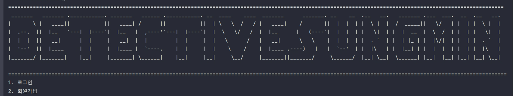

# JAVA mini project
<br/>


⬜⬜⬜⬜⬜⬜⬜⬛⬜⬜⬜⬜⬜⬛⬛⬛⬛⬛⬛⬛⬛⬜⬜⬜⬜⬛⬛⬛⬛⬛
⬜⬜⬜⬜⬜⬜⬜⬜⬛⬛⬛⬛⬛⬛⬛⬛⬛⬛⬛⬛⬛⬛⬛⬜⬛⬛⬛⬛⬛⬜
⬜⬜⬜⬛⬛⬛⬛⬛⬛⬛⬛⬛⬛⬛⬛⬛⬛⬛⬛⬛⬛⬛⬛⬛⬛⬛⬛⬛⬜⬜
⬜⬜⬜⬜⬜⬛⬛⬛⬛⬛⬛<b>안녕! 내 이름은 성민</b>⬛⬛⬛⬛⬛⬛⬛⬜⬜
⬜⬜⬜⬜⬜⬜⬛⬛⬛⬛⬛⬛⬛⬛⬛⬛⬛⬛⬛⬛⬛⬛⬛⬛⬛⬛⬛⬛⬛⬛
⬜⬜⬜⬛⬛⬛⬛⬛⬛⬛⬛⬛⬛⬛⬛⬛⬛⬛⬛<b>탐정이지</b>⬛⬛⬛⬛⬜
⬜⬜⬛⬛⬛⬛⬛⬛⬛⬛⬛⬛⬛⬛⬛⬛⬛⬛⬛⬛⬛⬛⬛⬛⬛⬛⬛⬛⬛⬜
⬜⬛⬛⬛⬛⬛⬛⬛⬛⬛⬛⬛⬛⬛⬛⬛⬛⬛⬛⬛⬛⬛⬛⬛⬛⬛⬛⬜⬜⬜
⬜⬛⬛⬛⬛⬛⬛⬛⬛⬛⬛⬛⬛⬛⬛⬛⬛⬛⬜⬛⬛⬛⬛⬛⬛⬛⬛⬛⬜⬜
⬛⬛⬜⬜⬛⬛⬛⬛⬛⬛⬜⬛⬛⬜⬜⬛⬛⬜⬛⬛⬜⬛⬛⬛⬛⬛⬛⬜⬜⬜
⬜⬜⬜⬛⬛⬛⬛⬛⬛⬛⬛⬛⬛⬛⬜⬜⬛⬛⬛⬛⬛⬛⬛⬛⬛⬛⬛⬜⬜⬜
⬜⬜⬛⬛⬜⬛⬛⬛⬛⬛⬜⬜⬛⬛⬛⬛⬛⬛⬜⬜⬜⬜⬛⬛⬛⬛⬛⬜⬜⬜
⬜⬜⬜⬜⬜⬛⬛⬛⬛⬛⬛⬛⬛⬜⬛⬛⬛⬜⬛⬛⬛⬜⬛⬛⬛⬛⬛⬜⬜⬜
⬜⬜⬜⬜⬜⬛⬜⬛⬛⬛⬛🟦🟦⬜⬛⬜⬛⬜⬛🟦🟦⬜⬜⬜⬛⬜⬛⬜⬜⬜
⬜⬜⬜⬜⬜⬜⬜⬛⬛⬜⬜⬛⬛⬜⬛⬜⬛⬜⬜⬛⬛⬜⬛⬜⬜⬜⬛⬜⬜⬜
⬜⬜⬜⬜⬜⬜⬜⬛⬜⬛⬜⬜⬜⬛⬜⬜⬜⬛⬜⬜⬜⬛⬛⬛⬛⬛⬛⬜⬜⬜
⬜⬜⬜⬜⬜⬜⬜⬛⬜⬜⬛⬛⬛⬜⬜⬜⬜⬜⬛⬛⬛⬛⬜⬛⬛⬜⬜⬜⬜⬜
⬜⬜⬜⬜⬜⬜⬜⬜⬛⬜⬜⬜⬜⬜⬛⬛⬜⬜⬜⬜⬜⬜⬜⬛⬛⬜⬜⬜⬜⬜
⬜⬜⬜⬜⬜⬜⬜⬜⬛⬛⬛⬜⬜⬜⬜⬜⬜⬜⬜⬜⬜⬛⬛⬛⬛⬛⬜⬜⬜⬜
⬜⬜⬜⬜⬜⬜⬜⬜⬜⬜⬛⬛⬛⬛⬛⬛⬛⬛⬛⬛⬛⬛⬜⬜⬜⬜⬜⬜⬜⬜
⬜⬜⬜⬜⬜⬜⬜⬜⬜⬜⬜⬛🟥⬛⬛⬜⬛⬛🟥🟥⬛⬜⬜⬜⬜⬜⬜⬜⬜⬜
⬜⬜⬜⬜⬜⬜⬜⬜⬜⬜⬛⬛🟥🟥⬛🟥⬛🟥🟥🟥⬛⬛⬜⬜⬜⬜⬜⬜⬜⬜
⬜⬜⬜⬜⬜⬜⬜⬜⬜⬛⏹️⬛🟥🟥⬛⬛⬛⬛🟥🟥⬛⏹️⬛⬜⬜⬜⬜⬜⬜⬜
⬜⬜⬜⬜⬜⬜⬜⬜⬛⏹️⏹️⏹️⬛⬛⬜⬜⬜⬜⬛⬛⏹️⏹️⏹️⬛⬜⬜⬜⬜⬜⬜
⬜⬜⬜⬜⬜⬜⬜⬛⬛⏹️⏹️⏹️⏹️⬛⬜⬛⬜⬛⬛⏹️⏹️⏹️⏹️⬛⬜⬜⬜⬜⬜⬜
⬜⬜⬜⬜⬜⬜⬛⬛⏹️⏹️⏹️🟦⏹️⏹️⬛⬜⬛⏹️⏹️⏹️⏹️⬛⏹️⏹️⬛⬜⬜⬜⬜⬜
⬜⬜⬜⬜⬜⬜⬛⏹️⏹️⏹️⏹️⏹️⏹️⏹️⬛⬛⏹️⏹️⏹️⏹️⏹️⬛⬛⏹️⏹️⬛⬜⬜⬜⬜
⬜⬜⬜⬜⬜⬜⬛⬛⏹️⬛⬛⏹️⏹️⏹️⏹️⬛⏹️⏹️⏹️⏹️⏹️⬛⬛⏹️⏹️⬛⬜⬜⬜⬜
⬜⬜⬜⬜⬜⬜⬜⬛⏹️⏹️⬛⏹️⏹️⏹️⏹️⬛⏹️⏹️⏹️🟦⬛⬛⏹️⏹️⏹️⬛⬜⬜⬜⬜
⬜⬜⬜⬜⬜⬜⬜⬛⏹️⏹️⬛⏹️⏹️⏹️⬛⬛⏹️⏹️⏹️⬛⏹️⏹️⏹️⏹️⬛⬜⬜⬜⬜⬜
⬜⬜⬜⬜⬜⬜⬜⬜⬛⏹️⬛⏹️🟦⏹️⬛⬛⬛⏹️⬛⬛⬛⏹️⬛⬛⬜⬜⬜⬜⬜⬜
⬜⬜⬜⬜⬜⬜⬜⬜⬜⬛⬛⏹️⏹️⬛⬜⬜⬛⏹️⬛⬜⬛⬛⬜⬜⬜⬜⬜⬜⬜⬜
⬜⬜⬜⬜⬜⬜⬜⬜⬜⬜⬛⬛⏹️⬛⬛⬛⬛⬛⬛⬛⬛⬜⬜⬜⬜⬜⬜⬜⬜⬜
⬜⬜⬜⬜⬜⬜⬜⬜⬜⬜⬛🟦⬛⬛🟦🟦🟦⬛⬛⬛⬛⬜⬜⬜⬜⬜⬜⬜⬜⬜
⬜⬜⬜⬜⬜⬜⬜⬜⬜⬜⬛🟦🟦⬛🟦🟦🟦🟦⬛🟦⬛⬜⬜⬜⬜⬜⬜⬜⬜⬜
⬜⬜⬜⬜⬜⬜⬜⬜⬜⬜⬛🟦🟦🟦🟦⬛🟦🟦🟦🟦⬛⬜⬜⬜⬜⬜⬜⬜⬜⬜
⬜⬜⬜⬜⬜⬜⬜⬜⬜⬜⬛🟦🟦🟦🟦⬛🟦🟦🟦🟦⬛⬜⬜⬜⬜⬜⬜⬜⬜⬜
⬜⬜⬜⬜⬜⬜⬜⬜⬜⬜⬜⬛⬛⬛⬛⬛⬛⬛⬛⬛⬛⬜⬜⬜⬜⬜⬜⬜⬜⬜
⬜⬜⬜⬜⬜⬜⬜⬜⬜⬜⬜⬛⬜⬛⬜⬜⬜⬛⬛⬛⬜⬜⬜⬜⬜⬜⬜⬜⬜⬜
⬜⬜⬜⬜⬜⬜⬜⬜⬜⬜⬜⬛⬜⬛⬜⬜⬜⬛⬜⬛⬜⬜⬜⬜⬜⬜⬜⬜⬜⬜
⬜⬜⬜⬜⬜⬜⬜⬜⬜⬜⬜⬛⬜⬛⬜⬜⬜⬛⬜⬛⬜⬜⬜⬜⬜⬜⬜⬜⬜⬜
⬜⬜⬜⬜⬜⬜⬜⬜⬜⬜⬛⬛⬛⬛⬜⬜⬛⬛⬛⬛⬜⬜⬜⬜⬜⬜⬜⬜⬜⬜
⬜⬜⬜⬜⬜⬜⬜⬜⬛⬛⬜⬜🟥⬛⬜⬛⬛⬜🟥⬛⬜⬜⬜⬜⬜⬜⬜⬜⬜⬜
⬜⬜⬜⬜⬜⬜⬜⬜⬛⬛⬜🟥🟥⬛⬜⬛⬜🟥🟥⬛⬜⬜⬜⬜⬜⬜⬜⬜⬜⬜
⬜⬜⬜⬜⬜⬜⬜⬜⬜⬛⬛⬛⬛⬜⬜⬛⬛⬛⬛⬜⬜⬜⬜⬜⬜⬜⬜⬜⬜⬜
<br/>

## 📽프로젝트 소개

도시는 오랜 시간 동안 평온했지만, 최근 들어 미스터리한 사건들이 연달아 일어나며 주민들의 불안이 커지고 있습니다. <br/>
명탐정 성민은 도시에 도착하자마자 도시에 대한 첫 인상을 남길 수 있는 중대한 사건을 맞이하게 됩니다. <br/>
추리, 호러 등 각 사건들을 해결해 주민들의 평화를 되찾아 주세요.

<br/>

## 💻주요기능

### 로그인 
#### 회원가입
  - 
  - 
#### 로그인
-   - 
-   - 
#### 회원탈퇴
- -   - 

### 게임
#### 3단계로 이루어진 스토리형 게임 (추리, 공포)
- 
- 

#### 힌트 보기
  - 
#### 게임 플레이 시간 측정 및 랭킹 조회
  - 
  - 
#### 모드에 따른 엔딩 크레딧 변화
- 

<br/>

## 📽 구현 영상

<summary>회원가입 - 로그인</summary>
        <details>
            <summary>  </summary>
            
        </details>

<summary>게임모드 - 추리모드</summary>
        <details>
            <summary>  </summary>
            
        </details>

<summary>게임모드 - 공포모드</summary>
        <details>
            <summary>  </summary>
            
        </details>

<summary>게임 랭킹 조회</summary>
        <details>
            <summary>  </summary>
            
        </details>

<summary>내 정보</summary>
        <details>
            <summary>  </summary>
            
        </details>

<br/>

## 💡 프로젝트 멤버
<table>
 <tr>
    <td align="center"><a href="https://github.com/sung-mini"></a></td>
    <td align="center"><a href="https://github.com/AYeong-Jeon"></a></td>
  </tr>
  <tr>
    <td align="center"><a href="https://github.com/sung-mini"><b>sung-mini</b></a></td>
    <td align="center"><a href="https://github.com/AYeong-Jeon"><b>AYeong-Jeon</b></a></td>
  </tr>
</table>
<br/>

## 💡 프로젝트 정보
<table>
  <tr>
    <td>시작일</td>
    <td>2024년 08월 14일</td>
  </tr>
  <tr>
    <td>종료일</td>
    <td>2024년 08월 18일</td>
  </tr>
  <tr>
    <td>사용언어</td>
    <td>JAVA</td>
  </tr>
</table>
<br/>


## ⚠️ 권장  commit 컨벤션

**`태그 : 제목`의 형태이며, `:`뒤에만 space가 있음에 유의한다.**

- `feat` : 새로운 기능 추가
- `fix` : 버그 수정
- `docs` : 문서 수정
- `style` : 코드 포맷팅, 세미콜론 누락, 코드 변경이 없는 경우
- `refactor` : 코드 리펙토링
- `test` : 테스트 코드, 리펙토링 테스트 코드 추가
- `chore` : 빌드 업무 수정, 패키지 매니저 수정
- `comment` : 주석 추가 및 변경
- `remove` : 파일, 폴더 삭제	ex) Fixes: #45 Related to: #34, #23
- `rename` : 파일, 폴더명 수정
<br/>

```
Feat: "회원 가입 기능 구현"
```

<br/>
<br/>


해당 README는 다음 레포지토리를 참고해서 제작하였습니다.
- https://github.com/CodeSquad-2023-BE-Study/Algorithm-Study/blob/main/README.md
- https://github.com/KbIt4Study/Algorithm_Study/edit/main/README.md
- https://github.com/algoSSAFY9/SSAFY_ALGO_STUDY/edit/main/README.md
